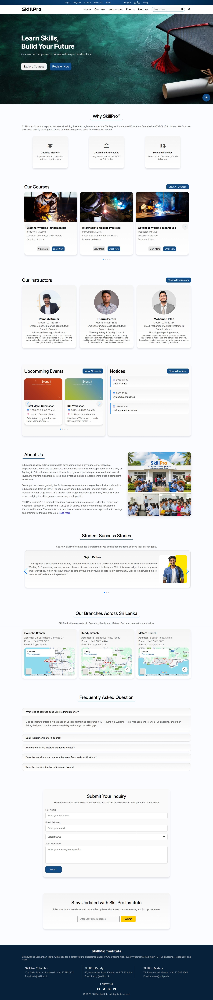
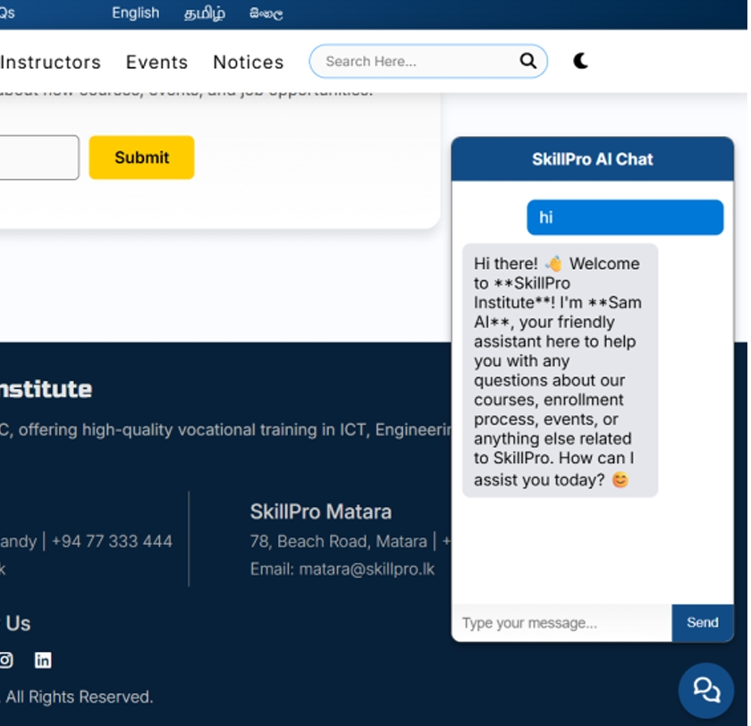
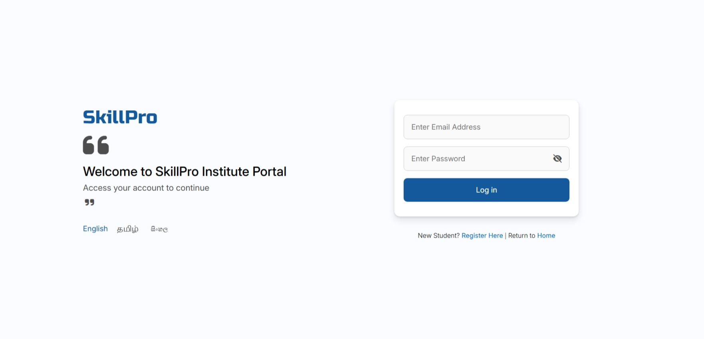
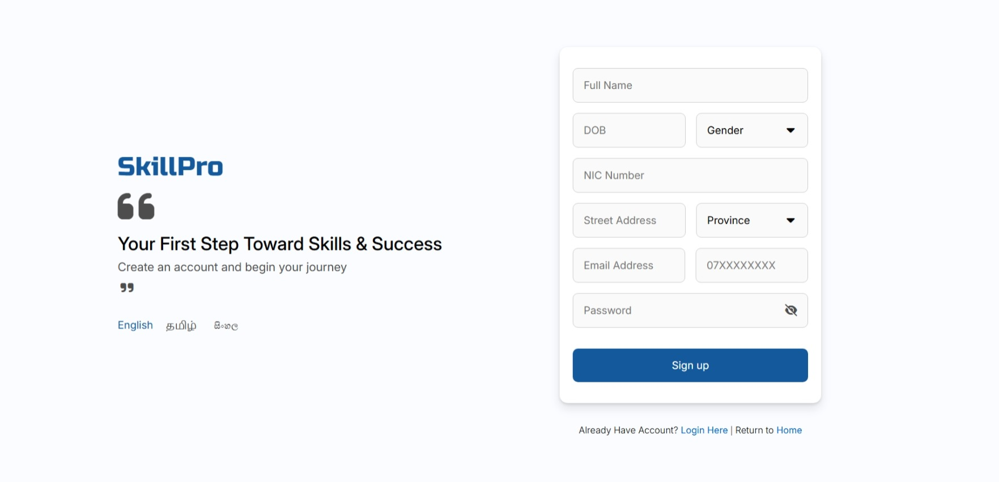
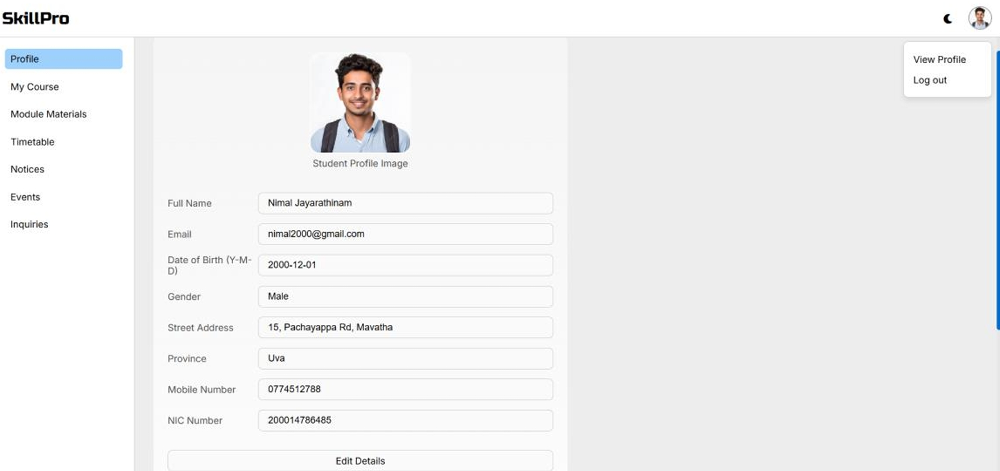
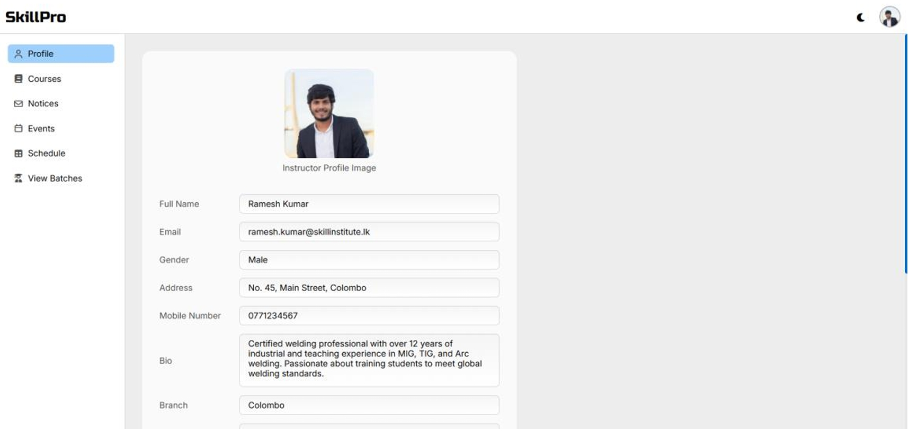
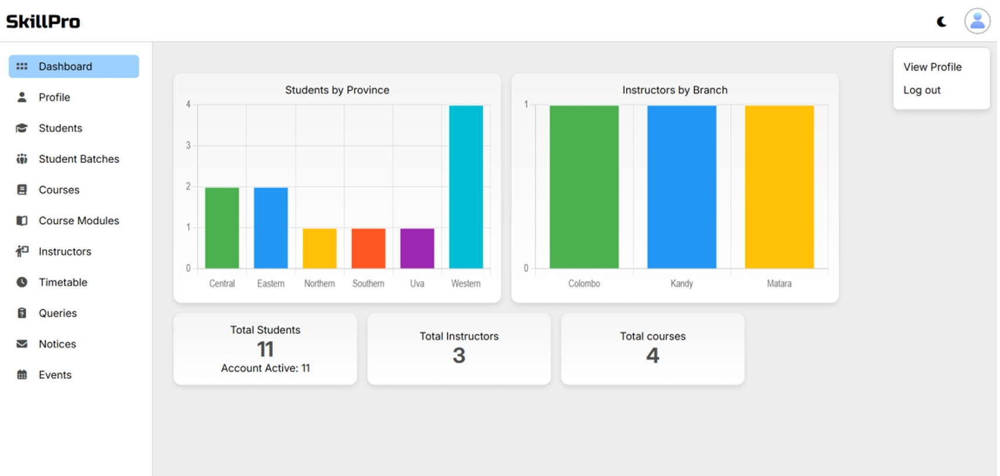

# SkillPro Institute Web Site & dashboards Project

**Project Name:** SkillPro Institute Web Site & Dashboards
 
**Developer:** Ludshathan Nadanesan  
**Tech Stack:** HTML, CSS, JavaScript, PHP, MySQL, PHPMailer, OpenRouter AI (free model)  
**Project Type:** Full-stack Web Application with AI Chatbot Integration

---

## 🚀 Project Overview

This project is a complete **web portal for SkillPro Institute** SkillPro Institute is a fictional, government-approved vocational training institute in Sri Lanka. This dynamic web application is designed to manage and promote SkillPro Institute's training programs. The system supports multiple user roles: Admin, Instructor, and Student, and provides an interactive and user-friendly experience.
It includes **website, admin dashboard, instructor dashboard, and student dashboard**, along with an **AI chatbot named Sam AI** to assist students in web site home page. The system includes comprehensive functionalities such as course management, student registration, instructor management, event notices, AI-based chat support, multi-language support, dark/light mode, and responsive design.

The platform allows users to:
- Browse and search courses by category, duration, location and instructures.
- Filter and search instructors.
- View events, notices, FAQs, and About Us information.
- Register inquiries.
- Register as a student and access their personalized student dashboard.
- Enroll in courses online and choose course mode (Online/On-site).

---

## 🎯 Features

### 🌐 Website Features (Public Access)
- Course browsing and filtering
- Instructor search and filtering
- Event and notice viewing
- FAQs and About Us pages
- Course registration guidance
- Inquiry submission form

### 👨‍🎓 Student Dashboard
- Register a student account
- View and edit personal details
- Enroll in courses and view enrollment status
- Ask doubts
- Access course timetables
- Change password

### 👨‍🏫 Instructor Dashboard
- View assigned courses
- Access student lists from related course
- Access course materials
- Access course timetables
- Change password

### 🛠 Admin Dashboard
- Manage courses, instructors, and students
- Update events, notices
- Monitor registrations and inquiries
- Manage course schedules or materials
- Manage student Batches 

### 🤖 AI Chatbot (Sam AI) in SkillPro Institute Home Page
- Integrated using OpenRouter AI (Free model)
- Answers student queries about courses
- Provides links for courses
- Typing animation and friendly professional responses

### Backend
- MVC Architecture
- Database: MySql
- PHP Mailer

### Frontend
- Fully responsive design for mobile, tablet, and desktop.
- Swiper.js used for smooth, interactive sliders.
- Font Awesome icons for better UI/UX experience.
- Google Maps for branch locations.
- Dark/Light mode and three-language support (English, Tamil and Sinhala) for better accessibility.

### 🛡 System & Security Features
- Secure file upload system (uploads folder protected from public access)
- Encrypted file names using SHA-256 with custom `PathEncryptor` class
- Role-based access control (Admin, Instructor, Student)
- Prevents unauthorized access to sensitive media and documents

### ⚙️ Error Logging System
- Database Error Logging: All MySQL-related errors or unexpected shutdowns are automatically written to a dedicated log file named `db_errors.log` located at `Logs` folder. 

---

## 🧰 Tech Stack & Tools

| Layer      |  Technology / Library          |
|------------|--------------------------------|
| Frontend   | HTML, CSS, JavaScript          |
| Backend    | PHP(MVC Architecture)          |
| Database   | MySQL                          |
| Emails     | PHPMailer                      |
| AI Chatbot | OpenRouter AI (Free model)     |

---

## 🎓 Key Learnings
- Full-stack web development with PHP, MySQL, and JS.
- Integrating AI chatbot with OpenRouter API.
- Building dynamic dashboards for students, instructors, and admin.
- Handling user authentication, data validation, and email notifications.
- Learned how to secure file uploads using hashing and access restrictions.
- Implemented custom SHA-256 encryption for upload path protection.
- Learned how to implement backend logging for MySQL errors or unexpected shutdowns using PHP.
- Gained experience in building secure file upload systems with encryption.

---

## 🖼️ Screenshots

### 🏠 Home Page

### 🤖 AI Chatbot (Sam AI)

### 🎓 Login Portal

### 🎓 Resgister Student Account

### 🎓 Student Dashboard

### 👨‍🏫 Instructor Dashboard

### 🛠 Admin Dashboard

---

---

---
